# AIPEIISR Product Requirements Document & System Architecture

**Version:** 1.1 - refined proposed MVP architecture  
**Status:** Stakeholder review draft  
**Decision rule:** AI produces attributable signals and recommendations; authorised people investigate, review, and publish findings.

## Executive Summary

AIPEIISR is an always-on, human-led, AI-augmented information monitoring and fact-checking platform. It continuously monitors permitted public information sources, detects and organizes claims, narratives, unusual information patterns and potentially manipulated content, and gives analysts and citizens tools to investigate information using evidence. Human reviewers remain responsible for verification and publication. It complements existing fact-checkers, media houses, election institutions, and civil-society organizations through feeds and APIs; it is not an autonomous fact-checker, content-moderation system, or political-persuasion tool.

The MVP proves one complete, auditable loop: public source -> normalized document -> AI signal/claim -> related-content cluster -> evidence retrieval -> analyst investigation -> peer review -> approved finding or clearly labelled alert. It starts with a deliberately small, permitted source set and demo data. The reported 2026 Osun State Governorship Election pilot with 30 trained analysts informs operational design, but this document makes no additional claims about that pilot.

The recommended implementation is a modular monolith: Next.js/TypeScript frontend, FastAPI backend, PostgreSQL with pgvector, Redis-backed workers, S3-compatible object storage, and Docker. It can run locally or on free/low-cost tiers, then separate workers and managed services when measured load requires them.

## 1. Background

Election information can move faster than distributed verification teams can coordinate. Public content may contain misinformation, disinformation, manipulated media, or AI-generated material. AIPEIISR gives trained analysts a shared, evidence-first workspace and gives trusted partners a controlled way to exchange approved information.

## 2. Problem Statement

Current monitoring and verification are fragmented; duplicated claims consume analyst time; source and evidence provenance can be lost; and stakeholders need timely, carefully worded information. The system must increase situation awareness without amplifying unverified claims or allowing a model to turn uncertainty into a verdict.

## 3. Vision

Provide accountable election-information integrity infrastructure in which evidence, provenance, independent human review, uncertainty, and source attribution are visible at every consequential step.

## 4. Objectives

1. Ingest accessible, permitted public content and partner feeds.
2. Detect election-relevant signals and structured factual claims.
3. Connect duplicate claims and emerging narratives while preserving source context.
4. Help analysts retrieve, assess, and document evidence.
5. Route only reviewed, authorized outputs to public or stakeholder channels.
6. Support a WhatsApp-compatible citizen inquiry and notification flow without making WhatsApp core business logic.

## 5. Guiding Principles

- **Human-led:** a signal is not a finding; AI cannot publish consequential content.
- **Evidence before conclusion:** every finding links to source material and an assessment.
- **Least collection:** collect only permitted public or submitted data needed for the purpose.
- **Partner, do not duplicate:** ingest and link trusted partners' approved work where authorized.
- **Proportionate MVP:** no nationwide monitoring, autonomous verdicts, or expensive infrastructure.
- **Political neutrality:** do not recommend candidates, rank parties, or suppress viewpoints for political convenience.

## 6. Users & Personas

| Persona | Goal | Authority |
|---|---|---|
| System administrator | Configure tenants, users, roles, sources, integrations, and audit controls | Admin configuration; cannot alter investigation conclusions without a workflow role |
| Situation Room manager | Balance workload, assign/escalate cases, approve operations | Assignment, escalation, alert authorization when separately permitted |
| Election information integrity analyst (primary) | Monitor continuous signals; investigate claims, narratives, media and unusual patterns; compare provenance; create cases; request evidence; escalate and submit findings | Create notes/evidence; submit investigation; request escalation |
| Peer reviewer | Independently test the analyst's reasoning and evidence | Request revision, approve/reject review |
| Fact-checking/media organization | Exchange feeds, submit material, consume approved findings | Scoped organization API access |
| Stakeholder | Receive suitable alerts/trends | Read-only, subscription-scoped access |
| Citizen / general user (primary) | Submit text, URL, image, video/media reference where feasible; search claims/findings; inspect evidence; understand known, unknown, disputed or under-investigation information; report suspicious content | Public submission, search and opt-in messaging only; never sees internal notes/private case data |

## 7. User Journeys

**Continuous monitoring:** Internet -> approved collector -> normalization/deduplication -> AI detection -> claim/narrative organization -> priority recommendation -> analyst queue. Monitoring identifies potentially relevant information; it does not assume a source or claim is false.

**Analyst:** A permitted RSS item is normalized, classified as election-relevant, and presented as a *signal*. A candidate claim and related documents are suggested. The analyst validates the claim text, gathers cited evidence, records an assessment and uncertainty, then submits it. A peer reviewer approves, rejects, or requests changes. Only an authorized publication action creates a public finding/alert.

**Citizen:** A citizen submits a message through the simulator or WhatsApp channel. The service acknowledges receipt, matches published findings when confidence is adequate, otherwise labels the item as awaiting human review. It never claims a model-only answer is verified.

**Partner:** A fact-checker publishes an authorized feed. A connector imports metadata and canonical links, preserving organization attribution. The partner receives only approved, organization-scoped API data.

**Citizen fact-check:** A citizen submits a URL, text, image, or feasible media reference. The platform searches existing claims/findings, related narratives, trusted and official sources, partner fact-checks, similar collected content and evidence. It returns a published human-reviewed finding, relevant but unresolved information, insufficient evidence, or an escalation recommendation. AI-assisted analysis is always visually distinct from a finding. Multiple matching submissions, potential impact, rapid spread, public-safety relevance, material uncertainty, missing reliable evidence, or a human-investigation need may create an analyst escalation that preserves the original submission, timestamp, metadata, AI analysis, related documents/claims, evidence and appropriate user context.

## 8. Functional Requirements

| REQ-ID | Name | Description | Priority | Actor | Preconditions | Input / Processing / Output | Acceptance Criteria | Dependencies / Security |
|---|---|---|---|---|---|---|---|---|
| FR-001 | Source management | Register, approve, pause and inspect sources/connectors. | P0 | Admin | Authenticated admin | Source metadata -> validate -> source record/status | Each source has method, schedule, health, language, geography, last success/error. | RBAC; URL allow/deny policy; audit |
| FR-002 | Document ingestion | Collect permitted API/RSS/HTTP content into a canonical document. | P0 | Worker | Active source | Payload -> normalize/hash/store -> `DocumentCreated` | Duplicate delivery is idempotent and raw payload is referenced. | SSRF protections; object storage |
| AI-001 | Relevance and claim extraction | Produce reviewable election relevance, claims, entities and uncertainty. | P0 | AI worker | Normalized document | Document -> structured suggestion + AI run | Output is labelled suggestion, cites document span, and can be rejected. | Model gateway; provenance |
| AI-002 | Similarity/narrative | Find related claims/documents and suggest narratives. | P0 | AI worker | Embedding available | Vectors/metadata -> ranked relationships | No automatic merge; analysts can split/merge with audit. | pgvector; bias evaluation |
| DATA-001 | Provenance and retention | Preserve source, collection, transformation, decision and retention metadata. | P0 | System | Any data write | Record lineage and classification -> governed storage | A reviewer can trace a finding to source, evidence, AI runs and people; retention jobs are logged. | Encryption; data minimization; audit |
| FR-003 | Evidence repository | Attach, assess, preserve and review evidence. | P0 | Analyst/reviewer | Case access | Evidence + rationale -> immutable provenance record | UI answers why attached, who added it, and linked claim/case. | Hashing; retention/access policy |
| FR-004 | Investigation workflow | Run controlled state transitions, assignment, review, revision and publication. | P0 | Manager/analyst/reviewer | Role + state guard | Action -> validate fields -> transition + audit | Invalid role/state transitions return 409; publication requires review approval. | RBAC; append-only audit |
| FR-005 | Situation room | Show queues, case workspace, live operational feed and health. | P0 | Internal roles | Authenticated | Queries/SSE -> role-scoped dashboard | Unverified signals never use published-finding treatment. | Row-level organization filtering |
| FR-006 | Public dashboard | Display published findings, methodology, sources, education and claim submission. | P0 | Citizen | Public access | Published data -> sanitized presentation | No analyst identity/notes/private evidence are exposed. | Content approval; rate limits |
| FR-007 | Alerts and simulator | Create approved alerts and route through notification abstraction. | P0 | Authorized manager | Approved finding or approved early warning | Template -> approval -> notification | Simulator shares the same API/event contract as WhatsApp adapter. | Consent, unsubscribe, delivery audit |
| FR-008 | Citizen fact-check and escalation | Accept text, URL and feasible media references; match evidence/findings and escalate qualifying submissions. | P0 | Citizen | Rate-limit/abuse checks pass | Submission -> safe analysis/search -> qualified result or analyst queue | Published finding, AI-assisted analysis, under investigation and insufficient-evidence states are distinct; escalation preserves provenance. | PII minimization; malware scanning; content controls |
| API-001 | Partner API | Provide versioned, scoped REST endpoints and webhooks. | P0 | Partner | OAuth/API credential | Request -> policy/pagination -> JSON | OpenAPI, rate limits, correlation ID, audit and revocation work. | TLS, scopes, webhook signing |
| SEC-001 | Security controls | Enforce identity, authorization, input, isolation and audit safeguards. | P0 | All | N/A | See section 21 | Privileged MFA and no untrusted content can invoke tools/actions. | Security test gate |
| NFR-001 | Reliability and performance | Keep user requests responsive while long work runs asynchronously. | P0 | All | Service healthy | API -> job queue -> status/SSE | API does not wait for model pipeline; retries are bounded/idempotent. | Redis/worker monitoring |
| MVP-001 | Safe demo mode | Seed controlled historical/public/synthetic data. | P0 | Admin/demo operator | Demo environment | Tagged dataset -> isolated tenant/banner | Synthetic/demo labels appear in UI/API and cannot be presented as current intelligence. | Content governance |

## 9. Non-Functional Requirements

Availability, latency, capacity and retention targets are **proposed engineering targets** to validate during Sprint 6, not promises. Design for 95% successful permitted collections, p95 read API latency below 500 ms excluding external calls, durable audit records, daily backups, and recovery exercises. Support English first; make language detection and interface localization extensible for Nigerian languages. Meet WCAG 2.1 AA where practical. All timestamps are UTC; display timezone is user-configurable.

## 10. Product Modules

1. Identity, organizations and RBAC; 2. source/connector management; 3. document pipeline; 4. AI intelligence; 5. claims/narratives; 6. evidence and cases; 7. review/publication; 8. internal situation room; 9. public portal; 10. notification/WhatsApp adapters; 11. partner API; 12. audit, analytics and operations.

## 11. AI/Agent Architecture

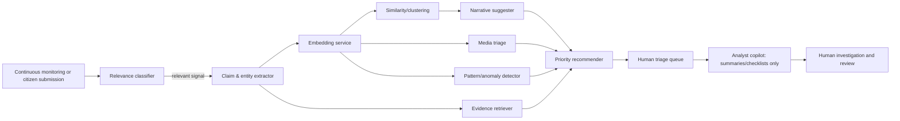

Components are bounded services/functions, not a single autonomous agent. The classifier returns relevance score/reasons; extraction returns text spans, schema validity, and uncertainty; similarity returns ranked candidates; narrative detection proposes a grouping; evidence retrieval returns links/snippets and query provenance; priority returns configurable factor contributions, never truth. The copilot has read-only, scoped retrieval and cannot send, publish, scrape, alter roles, or invoke external tools. Every output records an `ai_run`.

Workers are bounded and permission-controlled: Monitoring Agent, Claim Intelligence Agent, Narrative Intelligence Agent, Evidence Retrieval Agent, Media Triage Agent, Pattern Detection Agent, Investigation Assistant, and Priority Agent. Media triage flags material requiring investigation and never conclusively declares media AI-generated or manipulated without appropriate evidence. Detection, extraction, matching, similarity, prioritization, investigation, verification and publication are distinct; no AI confidence score is a truth score.

## 12. Data Architecture

Canonical `Document`:

```json
{"id":"uuid","source_id":"uuid","url":"https://...","title":"string","author":"string|null","published_at":"UTC","content":"string","media":[],"language":"string","location":"object|null","metadata":{},"collected_at":"UTC","content_hash":"sha256","source_hash":"sha256","raw_payload_ref":"object://..."}
```

Raw collection payloads go to object storage; normalized, relational, provenance and workflow data go to PostgreSQL; embeddings go to pgvector in PostgreSQL for MVP. Media binary data stays outside the database. PII (citizen contact details) is separated, encrypted, and subject to retention/deletion policy.

## 13. Ingestion Architecture

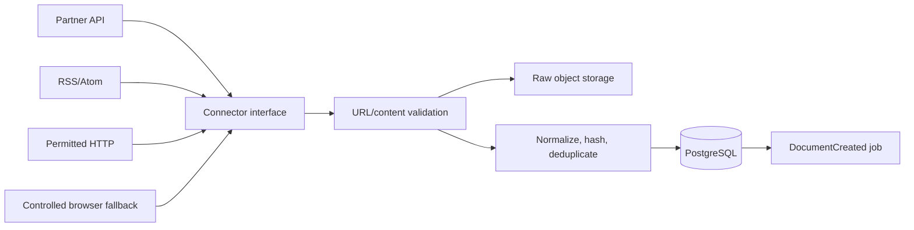

The priority is API, RSS/feed, HTTP collection, permitted scraping, then browser automation. Connectors implement `discover`, `fetch`, `normalize`, `healthcheck`, and `checkpoint`. A unique `(source_id, source_hash)` plus content-hash dedupe makes retries safe. Use exponential backoff with jitter, bounded attempts, dead-letter records, and a manual replay control. Browser automation runs in a network-restricted, non-privileged container only when an approved source needs it. Respect terms, robots controls where applicable, rate limits, and source authorization.

## 14. Claim & Narrative Intelligence

A **signal** is a potentially important observation. A **claim** is a specific factual assertion. A **narrative** is a human-governed grouping of related claims/content. A **finding** is a reviewed human conclusion. An **alert** is an approved communication, not automatically a finding.

Claim fields: ID; canonical/original text; cited source documents and spans; first/last observed; type; entities; location; election; language; narrative membership; mentions and legitimately available engagement; evidence; related claims; investigation; status; uncertainty/confidence metadata; AI provenance; human decisions; and audit history. Claim confidence describes extraction/matching confidence, not factual truth.

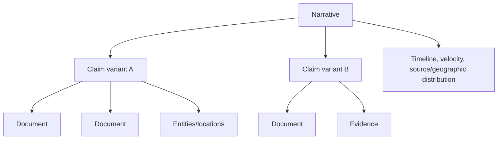

Narrative velocity is a transparent time-windowed count of observed mentions, shown with collection coverage caveats. Geographic distribution reflects only explicit/credible location metadata. Emerging narrative alerts require human triage and state that coverage is incomplete.

## 15. Evidence Architecture

Evidence may be official record, partner fact-check, source document, archive, analyst-collected material, or contextual reference. Fields are ID, type, source/URL/title/content reference, source and collection times, collector, cryptographic hash where meaningful, archive/reference, claim/case relation, attachment rationale, analyst assessment, review status, and immutable event history. The application displays both the evidence itself and “why attached.” Evidence is not automatically proof; assessment and review are separate fields.

## 16. Human Verification Workflow

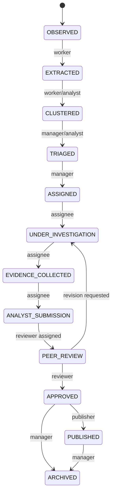

Only a manager assigns/escalates; the assigned analyst records investigation/evidence and submits; an independent peer reviewer approves, rejects, or requests revision; an authorized publisher publishes an approved item. Every transition records actor, prior/new state, timestamp, reason, and correlation ID. Submission requires claim wording, evidence links/rationale, assessment, uncertainty, and analyst declaration. Approval requires reviewer rationale and no unresolved required evidence issues. Escalation is available for configurable public-safety, velocity, or election-critical conditions but remains an operational decision.

## 17. Situation Room UX

Command Center shows active/high-priority cases, emerging narratives, workload, recent approved alerts, collection/worker health, and meaningful geographic indicators. The live feed separates signal, operational, and publication events. Queue filters include priority, status, geography, topic, analyst, age, narrative, and source. Workspace has original content, claim variants, timeline, related material, evidence, source view, AI output/provenance, analyst notes, review controls, and audit history. Visual states are intentionally distinct: `Signal / unverified`, `Under investigation`, `Published finding`.

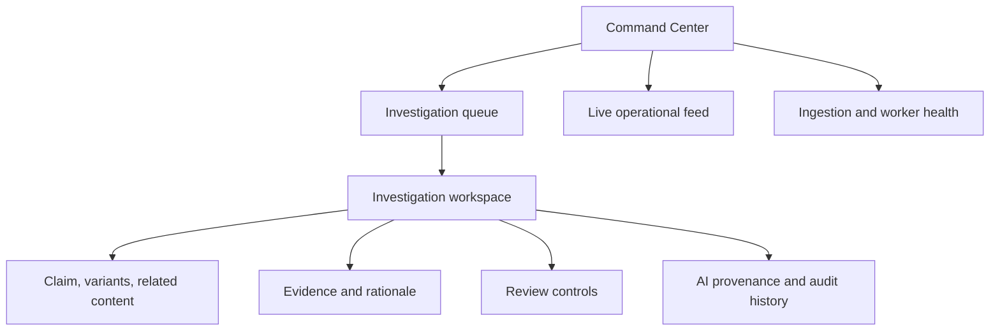

## 18. Public Platform

The public portal exposes only published findings, approved alerts, methodology, source links, educational material, aggregates, and claim submission. It suppresses analyst notes, precise sensitive operational details, private contacts, and unreviewed evidence. Every item presents publication time, status, methodology link, and source attribution. A content warning and contextual wording mitigate accidental amplification.

## 19. WhatsApp Architecture

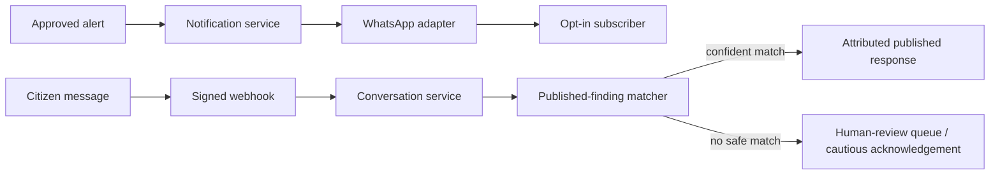

MVP uses a web simulator implementing the same `NotificationProvider` and `ConversationProvider` contracts. Production adapter requires official WhatsApp Business access, opt-in/opt-out, approved templates, webhook signature validation, delivery status, consent records, and retention limits. An uncertain inquiry receives no conclusion: it is labelled as unverified/awaiting review and offers source/methodology guidance.

## 20. API Specification

Base path is `/api/v1`; OpenAPI is generated by FastAPI. Required resources: `/auth`, `/users`, `/organizations`, `/sources`, `/documents`, `/claims`, `/narratives`, `/evidence`, `/cases`, `/investigations`, `/reviews`, `/alerts`, `/notifications`, `/whatsapp`, `/analytics`, `/health`.

Use OIDC session/JWT for people, short-lived scoped API tokens or OAuth2 client credentials for partners, and signed webhooks. List responses use `limit` (1-100), opaque `cursor`, `sort`, and allowlisted filters; return `{data, next_cursor, meta}`. Mutations require `Idempotency-Key`; responses include `X-Request-ID`. Use RFC 9457-style problem JSON for 400/401/403/404/409/422/429/5xx. Rate limits are role/client/source-specific. The API never exposes unapproved records through a public token.

Example claim response (internal):

```json
{"id":"uuid","status":"UNDER_INVESTIGATION","canonical_text":"...","uncertainty":{"extraction":"medium"},"evidence":[{"id":"uuid","relation":"contextual"}],"ai_provenance":["ai_run_uuid"],"links":{"case":"/api/v1/cases/uuid"}}
```

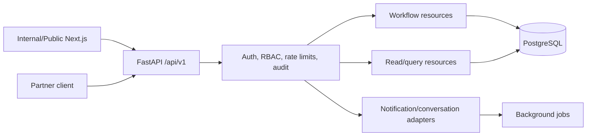

## 21. Security Architecture

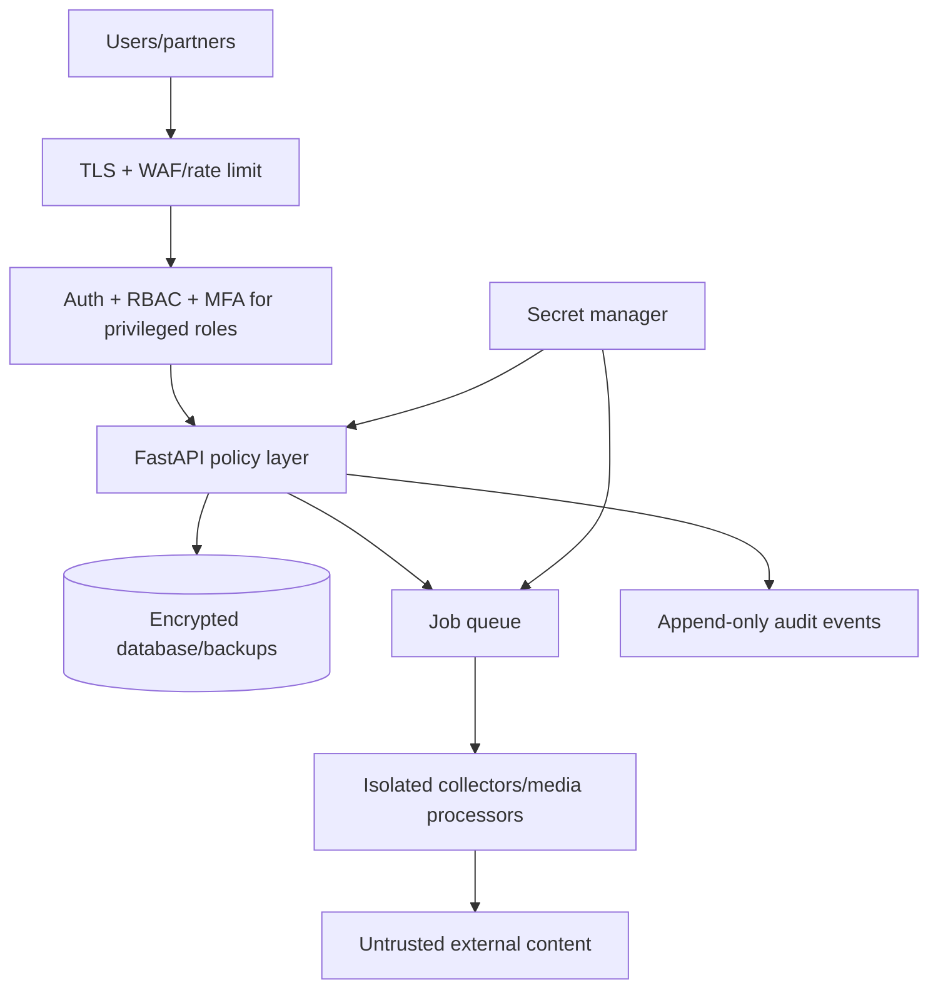

Enforce TLS, encrypted storage/backups, secret manager or environment injection (never repository secrets), password hashing, MFA for administrators/publishers, RBAC and organization scoping, signed/rotated service credentials, schema validation, CSRF protections for cookie sessions, CSP, secure headers, and audit review. Validate DNS/IP destinations and block private/link-local ranges to limit SSRF; cap download type/size/time; scan uploads; render/sandbox untrusted documents; and execute collectors/browser sessions with no production credentials or write access.

Treat every scraped page, attachment, prompt, and partner payload as data, never instructions. Retrieval output is isolated from system prompts and tool permissions. Model tools are allowlisted, read-only and tenant-scoped. Alert/publication endpoints require server-side human approval state, not a model response. Maintain incident runbooks for credential revocation, source suspension, suspicious AI output, privacy requests, and recovery. Perform daily encrypted backups, test restores, and use defined RPO/RTO after stakeholder agreement.

## 22. AI Safety & Governance

The model must cite retrieved source IDs, distinguish quotation from inference, express uncertainty, and return “insufficient evidence” when appropriate. It cannot fabricate evidence, infer protected traits, or autonomously publish. Content is screened for prompt injection; external text is delimited as untrusted context. Humans can reject/override any AI recommendation, with rationale recorded. Evaluation datasets include adversarial instructions, false/true/ambiguous claims, and multilingual content. Govern model/prompt changes through versioned templates, test gates, rollback, cost ceilings, and review of disparate false-positive patterns.

## 23. Infrastructure

Docker Compose provides local parity. Services are frontend, FastAPI API, worker, PostgreSQL/pgvector, Redis, and object-storage adapter. SSE/WebSockets serve live updates. Configuration uses typed environment variables and feature flags. CI runs lint, tests, migration checks, dependency/security scans, and build images.

## 24. Zero-Budget MVP Deployment

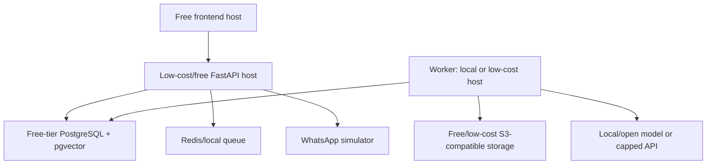

Use local Docker for demonstrations; free tiers only where their terms, capacity, residency, and availability fit the demonstration. Limit sources, collection frequency, retained raw payloads, model calls, and media analysis. Use RSS/public permitted sources, historical/synthetic labelled data, local embedding models, and a capped optional API budget. This is a demonstration architecture, not a guarantee of production reliability.

## 25. Production Deployment

Start from the same contracts, then use managed PostgreSQL with backups/replica, managed Redis, private object storage, container workers, secret manager, monitoring, CDN/WAF, and a managed identity provider. Separate ingestion workers (Phase 2), then AI workers (Phase 3), add dedicated search only after pgvector/query evidence proves need (Phase 4), event streaming only after queue limits justify it (Phase 5), and multi-zone/high-availability deployment (Phase 6). Do not introduce Kubernetes, Kafka, Elasticsearch, ClickHouse, or microservices without a measured requirement.

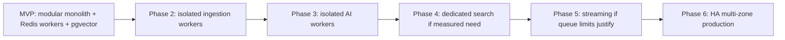

## 26. Database Design

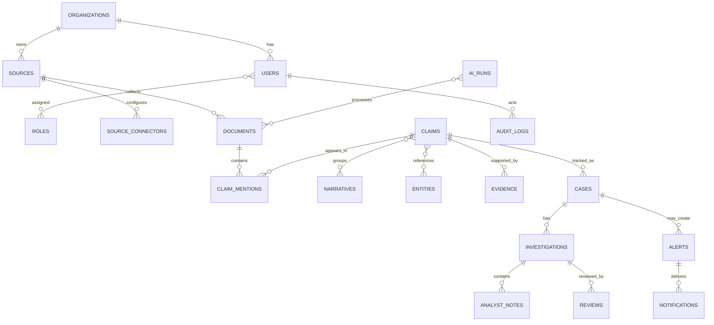

All primary IDs are UUIDs; records have `created_at`, `updated_at`, and where appropriate `deleted_at`, `deleted_by`. Join tables preserve many-to-many relations and actor/timestamps. Foreign keys are restrictive for evidence/audit records; normal business rows use soft deletion. Key unique constraints: `users(email)`, `sources(organization_id, canonical_url)`, `documents(source_id, source_hash)`, `source_connectors(source_id, connector_type)`, `subscriptions(channel, normalized_destination)`. Index document published/collected times; claims status/priority/observed times; case assignee/status; audit entity/time; notifications status; and HNSW/IVFFlat vector index after empirical validation. Store audit logs append-only, partitioned by time when volume warrants.

## 27. Event & Background Processing

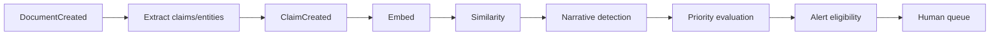

Each job carries event ID, tenant, idempotency key, causal IDs, attempt count, and schema version. Workers use transactional outbox publishing; consumers deduplicate. Failed jobs retry with exponential backoff then enter a visible dead-letter queue. Job results cannot bypass workflow authorization.


## 28. Observability

Structured logs redact secrets/PII. Track collection success/latency, source freshness, queue depth/age, worker failures, AI model/cost/latency, extraction/retrieval evaluations, API p50/p95/errors, DB connections/slow queries, object-storage failures, notification delivery, and audit export integrity. Dashboards cover operations, AI quality/cost, security, and partner integrations. Alerts route to on-call only for actionable thresholds.

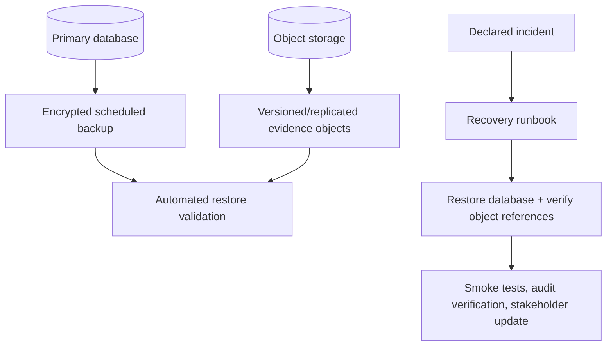

## 29. Testing Strategy

Unit-test workflow guards, priority factor calculations, dedupe, permission checks, and data transforms. Integration-test migrations, connector fixtures, storage, queue, model gateway, API and notification adapters. E2E test `source -> claim -> investigation -> finding -> alert` and ensure unauthorized/AI-only publication fails. Build a controlled, labelled evaluation corpus with historical/public/synthetic data; assess relevance, extraction, clustering, retrieval citations, hallucination, and false positives by language/source class. Security tests cover authz, token revocation, injection, malicious URLs/documents, webhook replay, SSRF, rate limits, and dependency scanning.

## 30. KPIs

Measure time publication-to-ingestion; eligible-content classification precision/recall; duplicate reduction; claim extraction acceptance; cluster acceptance; retrieval usefulness; analyst time-to-assignment/first action/review; queue age/workload; alert approval-to-delivery and delivery/acknowledgement; uptime, API latency, collection success, job failure, and AI cost per processed document. Baselines and targets must be agreed after a labelled pilot dataset and operating window are selected.

## 31. MVP Scope

| Priority | Included capability |
|---|---|
| P0 | RBAC/authentication, source management, RSS/API and limited HTTP ingestion, documents, classification/extraction, embeddings/clustering, basic narratives, evidence/cases/review/audit, internal/public dashboards, alert simulator, WhatsApp simulator architecture, REST API, monitoring |
| P1 | Partner self-service feeds, multi-language evaluation, richer analytics, production WhatsApp adapter, media metadata/perceptual hash, operational playbooks |
| P2 | Large-scale social coverage, dedicated search, advanced geospatial analysis, reverse-image integrations, sophisticated media models, streaming/HA multi-region |

## 32. Out-of-Scope Features

Nationwide real-time monitoring; every social network; perfect deepfake detection; autonomous fact-checking or political moderation; candidate/party ranking; persuasion; native mobile app; Kubernetes; microservices; Kafka; large-scale streaming; expensive commercial feeds; and unreviewed automated publishing are excluded from MVP.

## 33. Development Roadmap

Assuming a small cross-functional team, an initial MVP is estimated at **12-16 weeks** plus stakeholder acceptance, subject to source access and security decisions.

| Sprint | Duration | Outcomes |
|---|---:|---|
| 0 Foundation | 2 weeks | repo, threat model, schema/migrations, auth/RBAC, CI, design system, demo-data policy |
| 1 Ingestion | 2 weeks | sources, RSS/API connectors, normalized document pipeline, health/retry |
| 2 AI assistance | 2 weeks | relevance/claim/entity extraction, embeddings, similarity, provenance/evaluation harness |
| 3 Situation room | 3 weeks | cases, evidence, assignment, review states, internal dashboard/audit |
| 4 Public experience | 2 weeks | published findings, methodology, safe claim submission, alert simulator |
| 5 Conversations | 2 weeks | conversation contract, simulator, notification consent/delivery; adapter readiness |
| 6 Validation | 2-3 weeks | security/performance testing, analyst exercises, stakeholder demonstration and remediation |

## 34. Cost Model

**Scenario A - Zero-budget demonstration (target ₦0-₦50,000):** local Docker/free tiers; small source list; synthetic/historical labelled data; local embeddings; capped API experimentation; simulator rather than paid WhatsApp. Account verification, domain, paid model use, and hosting may make zero spend impractical.

**Scenario B - funded pilot:** budget separately for managed database/compute/storage/backups, model inference/embeddings, messaging, observability, security testing, source access, and people. Obtain current vendor quotations before commitment; no exact vendor price is asserted here.

**Scenario C - election production:** model cost from documents/day x processing stages x average tokens; storage from raw/media retention; compute from connector/worker concurrency; database/search from records and vector query volume; messaging from opt-in messages; plus data providers, monitoring, security and personnel. Scale decisions are made from observed source count, daily documents, analyst count, and API/message volume.

## 35. Risks & Mitigations

Qualitative probability must be calibrated with stakeholders; the following labels are initial rationale-based assessments.

| Risk | Probability / impact | Mitigation, detection, owner |
|---|---|---|
| Misinformation amplification | Medium / High | Neutral summaries, limited public display, human approval; monitor shares/complaints; Product lead |
| False positives/negatives | Medium / High | Evaluation, thresholds, reviewer feedback; sample audits; AI lead |
| Hallucinated evidence | Medium / High | Citation-required retrieval, no-evidence response; provenance checks; AI lead |
| Source manipulation/coordinated attacks | Medium / High | Source reputation, anomaly review, diverse sources; trend audit; Manager |
| Prompt injection/malicious pages | High / High | Isolation and no tool authority; injection tests/logging; Security lead |
| Scraper/API/WhatsApp failure | Medium / Medium | Fallbacks, retries, status dashboard; health alerts; Engineering lead |
| Privacy/data exposure | Medium / High | Data minimization/encryption/RBAC; access anomaly alerts; DPO/security |
| Analyst bias/overload | Medium / High | Peer review, rotation, workload dashboard; decision sampling; Manager |
| Infrastructure outage | Medium / High | Backup/restore, graceful degradation; synthetic drills; DevOps |
| Legal/election sensitivity | Medium / High | Counsel/policy review and documented governance; complaint/escalation process; Program lead |

## 36. Future Evolution

Add dedicated ingestion and AI worker pools first; add a search platform, event streaming, high availability, richer media analysis, additional language models, and partner federation only after load, quality, and governance data demonstrate value. Media output remains “potentially manipulated - requires investigation” unless evidence supports a stronger conclusion.

## 37. Acceptance Criteria

1. An approved RSS/API fixture reaches a normalized, deduplicated document with raw reference and audit events.
2. A model suggestion is displayed as a signal/claim suggestion with provenance and can be rejected.
3. A duplicate claim can be linked or kept separate by an analyst, with rationale.
4. A case cannot enter published state without required evidence, independent review, and authorized publisher action.
5. Public/API callers cannot retrieve unapproved cases, notes, PII, or restricted evidence.
6. The simulator routes an approved alert and logs consent, delivery outcome, and opt-out.
7. Malicious prompt/web content cannot cause a privileged action or access internal secrets.
8. Restore testing demonstrates recovery of database and evidence references within agreed RPO/RTO.
9. Synthetic/demo records are visibly labelled in UI and API exports.
10. Operational dashboards expose ingestion, queue, failure, and AI cost/quality signals.

## 38. Open Architectural Decisions

1. **Source authorization:** which sources, agreements, rate limits, and retention terms apply?
2. **Data governance:** legal basis, data-residency expectation, citizen-contact retention, and deletion process?
3. **Finding taxonomy:** which verdict/assessment categories and wording are approved by governance stakeholders?
4. **Reviewer independence:** organization conflict-of-interest and quorum policy?
5. **Languages:** initial supported Nigerian languages and evaluation corpus ownership?
6. **WhatsApp:** legal entity, consent model, template approvals, and production account owner?
7. **Threat response:** escalation contacts and public-safety threshold definition?
8. **Partner access:** who may submit, see queues, or consume findings and at what data classification?
9. **Model policy:** approved providers/local models, data processing agreement, and spend ceiling?
10. **Operations:** service owner, incident SLA, support hours, and funding horizon?

## 39. Final Recommended Architecture

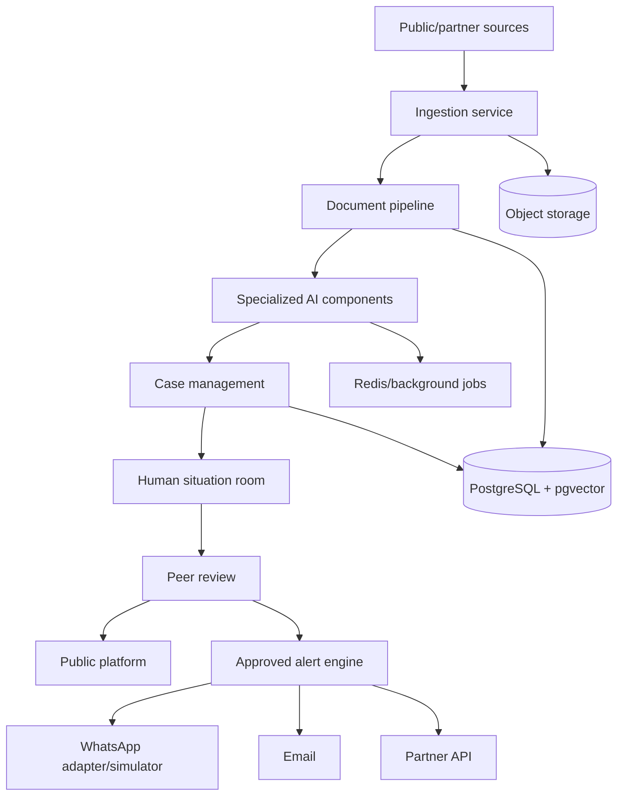

## 40. Implementation Backlog

1. Establish governance, threat model, source/retention policy, finding taxonomy and demo-data labels.
2. Scaffold Docker, FastAPI, Next.js, PostgreSQL/pgvector, migrations, CI and secrets conventions.
3. Build OIDC/RBAC, organizations, audit middleware, admin source controls.
4. Implement connector contract, RSS/API fixture, normalization, hashing, object references, retries and health.
5. Build document/case/claim/evidence schema and internal APIs.
6. Add model gateway, extraction schema validation, provenance, embeddings and evaluation corpus.
7. Implement similarity suggestions, human narrative controls and explainable priority factors.
8. Build workflow guards, assignment, notes, peer review and publication authorization.
9. Build Command Center, queue/workspace and public portal status separation.
10. Build notification contract, consent/subscriptions and WhatsApp simulator.
11. Add partner API, rate limiting, signed webhooks, observability and cost dashboard.
12. Run analyst exercises, security tests, restore drill, accessibility review and stakeholder demo.

## Architectural Decision Records

### ADR-001 - Python/FastAPI
**Context:** API, data jobs and AI integrations need one productive backend. **Decision:** FastAPI/Python. **Alternatives:** Node, Django, Go. **Rationale:** strong ML/data ecosystem, typed API schemas and async support. **Consequences:** disciplined type checking, worker isolation and performance testing are required. **Migration:** APIs/contracts are language-neutral.

### ADR-002 - PostgreSQL
**Context:** workflow data needs transactions and relationships. **Decision:** PostgreSQL. **Alternatives:** document store, managed proprietary DB. **Rationale:** mature relational integrity, JSON, full text and low-cost availability. **Consequences:** schema/migration discipline. **Migration:** read replicas/managed service before sharding.

### ADR-003 - pgvector
**Context:** similarity is needed without a separate search stack. **Decision:** pgvector for MVP. **Alternatives:** hosted vector DB, dedicated search. **Rationale:** fewer systems and transactional metadata proximity. **Consequences:** benchmark indexes/recall. **Migration:** dual-write/reindex to dedicated vector/search service when justified.

### ADR-004 - Modular monolith
**Context:** MVP needs speed and audit consistency. **Decision:** one deployable API with separable modules/workers. **Alternatives:** microservices. **Rationale:** reduced operational cost/complexity. **Consequences:** module boundaries and queue contracts must be explicit. **Migration:** extract hot worker domains first.

### ADR-005 - Specialized AI components
**Context:** one agent obscures failure modes. **Decision:** bounded classifier, extractor, retriever, clustering and priority components. **Alternatives:** general autonomous agent. **Rationale:** evaluation, provenance, least privilege. **Consequences:** orchestration/versioning work. **Migration:** replace components independently.

### ADR-006 - Human verification
**Context:** election findings have high consequence. **Decision:** human evidence and peer review gate publication. **Alternatives:** model-only automated fact checking. **Rationale:** accountability and uncertainty. **Consequences:** analyst capacity is a constraint. **Migration:** improve assistance, never remove consequential approval without governance decision.

### ADR-007 - API/RSS before scraping
**Context:** collection must be stable and respectful. **Decision:** use structured/authorized interfaces first. **Alternatives:** scrape everything. **Rationale:** provenance, reliability, lower legal/technical risk. **Consequences:** less initial coverage. **Migration:** add approved connectors.

### ADR-008 - Controlled browser agents
**Context:** a few sources may require rendering. **Decision:** isolated browser fallback only. **Alternatives:** unrestricted browser automation. **Rationale:** limit malicious-page and credential risk. **Consequences:** operational cost and restrictions. **Migration:** use dedicated sandbox pool if volume grows.

### ADR-009 - WhatsApp as adapter
**Context:** messaging-provider policy and availability vary. **Decision:** notification/conversation interfaces isolate WhatsApp. **Alternatives:** embed provider logic throughout product. **Rationale:** simulator/testability and provider portability. **Consequences:** adapter work. **Migration:** switch provider/configuration without changing cases.

### ADR-010 - Zero-budget MVP
**Context:** demonstration must be viable before funding. **Decision:** local/free-tier, constrained architecture. **Alternatives:** production-scale cloud first. **Rationale:** validates loop and operations cheaply. **Consequences:** availability/scale limits must be explicit. **Migration:** managed services and workers follow the same contracts.

## One-page Architecture Summary for Non-Technical Stakeholders

AIPEIISR watches a limited set of permitted public and partner information sources. It organizes potential election-information issues so trained analysts can work faster. The AI can identify possible claims, related material, and useful sources, but it does not declare what is true. Analysts document evidence, an independent reviewer checks the work, and only authorized people publish findings or send alerts. Public users see clearly labelled published findings, carefully worded alerts, methodology, and ways to submit a claim. The first version uses inexpensive components and a WhatsApp simulator; it deliberately postpones nationwide surveillance, perfect media detection, and complex infrastructure. This makes the demonstration credible, safe, and expandable when governance, partners, and funding are in place.

## Version 1.1 Refinements

### Refined Product Architecture

The Situation Room is the professional monitoring, investigation, coordination and verification environment for analysts; it is not the whole product. The broader platform has seven connected capabilities: Continuous AI Monitoring; Information Intelligence and Evidence; Analyst Situation Room; Citizen Fact-Checking; Human Review and Verification; Public Findings and Alerts; and Partner/API Integration.

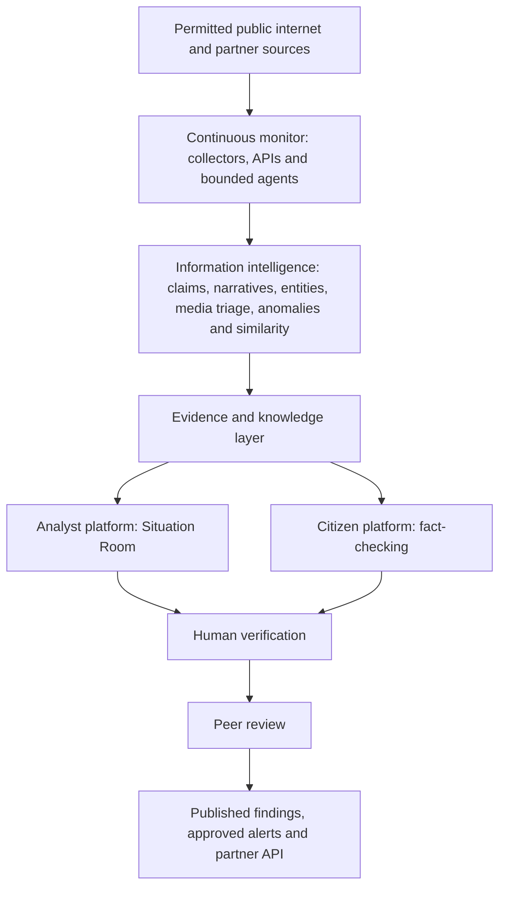

The Continuous Information Monitoring Layer uses the source-to-collector-to-normalizer-to-deduplication-to-document-store-to-AI-analysis pipeline. It continuously schedules permitted RSS/Atom, news, public web, selected public content/social sources where permitted, partner API/feed, fact-check and official-source collection. Its role is to detect election relevance, claims, narratives, repeated or rapidly spreading content, contextual information, unusual patterns, possible media concerns and potentially high-impact information for human attention. It does not make a falsity determination.

### Refined Evidence and Citizen Experience

Analysts retain a detailed evidence workspace with provenance, rationale, assessment, review history, raw references and audit trail. Citizens receive a comprehensible view: source, date, relevant context, source type, link/reference, relationship to the claim, and whether a human reviewed it. The interface avoids internal analyst notes and sensitive case information.

Citizen response states are mandatory and mutually distinct:

1. **Published human-reviewed finding** - a reviewed and authorized conclusion with cited evidence.
2. **AI-assisted analysis** - a non-authoritative organized search/match result.
3. **Under investigation** - an analyst case exists; no conclusion is implied.
4. **Insufficient evidence** - the system cannot responsibly provide a conclusion.

Citizen submissions are retained as a separate provenance-bearing record linked to claims, documents, evidence, narratives, cases and findings as available. Contacts and submitted content follow minimization, consent, malware scanning, retention and deletion policies. Public upload/media processing is size/type limited and isolated from privileged services.

### Updated KPIs

In addition to existing operational measures, track sources monitored, documents collected, collection success and latency, duplicate-reduction rate, relevant claims detected, clustering acceptance, evidence retrieval success, analyst triage and detection-to-investigation time, investigations completed, peer-review turnaround and revision rate, published findings, citizen submissions, successful evidence matches, escalated submissions, and citizen-submission-to-analyst-review time. These are operational quality measures, not automated political-truth scores.

### Final Refined Architecture

The recommended MVP remains Next.js/TypeScript, FastAPI/Python, PostgreSQL with pgvector, Redis/background workers, S3-compatible object storage, Docker, REST APIs and SSE/WebSockets where useful. It is a modular monolith with bounded worker components. It does not require Kubernetes, Kafka, complex microservices or full-internet coverage. The MVP proves the complete loop: public information -> continuous collection -> AI detection -> claim/narrative organization -> evidence retrieval -> analyst investigation or citizen fact-check -> human verification -> published finding/alert.

### Refined MVP Scope

- **Monitoring:** manually approved small source set; scheduled RSS/Atom, permitted web collection and selected APIs/feeds.
- **Intelligence:** relevance, claim/entity extraction, similarity, basic narrative clustering, basic anomaly detection, evidence retrieval, priority recommendation and basic media triage.
- **Analyst:** Situation Room, queue, evidence workspace, cases, peer review and findings workflow.
- **Citizen:** submit claim/URL; feasible media reference; search existing claims/findings; AI-assisted investigation; evidence display; analyst escalation.
- **Public:** published findings, approved alerts, methodology and source/evidence references.

### Primary User Journeys

1. **Continuous monitoring:** Internet -> collector -> AI analysis -> signal/claim detection -> clustering -> prioritization -> analyst queue.
2. **Analyst fact-check:** signal/claim -> case -> evidence gathering -> investigation -> submission -> peer review -> finding -> publication.
3. **Citizen fact-check:** citizen submission -> AI analysis/evidence search -> existing finding or qualified investigation guidance -> optional analyst escalation.
4. **Emerging information threat:** information spike -> pattern detection -> related claims -> analyst alert -> investigation -> human review -> appropriate communication.

### Refined MVP Acceptance Criteria

1. A scheduled approved source is collected repeatedly, deduplicated and traceable to its raw payload and AI runs.
2. A citizen may submit text or URL and receives a correctly labelled published finding, AI-assisted analysis, under-investigation status, or insufficient-evidence outcome.
3. A qualifying citizen submission becomes an analyst case without losing submitted content, provenance, related information or audit history.
4. Media triage and pattern-detection outputs are labelled recommendations requiring investigation.
5. An analyst can progress a monitoring or citizen-originated claim through evidence, review and authorized publication; AI alone cannot publish.
6. Public users cannot access internal evidence assessments, notes, PII or unreviewed cases.

### Phase 2 Expansion Opportunities

Add more approved connectors and language evaluation, production WhatsApp adapter, partner self-service, richer media-analysis integrations, analyst workload optimization, dedicated worker pools, and managed reliability/security services. Add dedicated search, event streaming or high availability only when measured load and operational need justify them.

### Open Decisions Requiring Stakeholder Approval

1. Approved source register, collection permissions, rate limits and retention terms.
2. Citizen submission consent, personal-data retention, media handling and deletion approach.
3. Finding taxonomy and exact public wording for unresolved/disputed content.
4. Escalation thresholds for public safety, volume and potential impact.
5. Reviewer independence, conflict-of-interest and publication authority.
6. Initial languages, accessibility needs and evaluation dataset ownership.
7. Partner API data classifications and fact-checking integration agreements.
8. Production model providers, data-processing terms, budget ceilings and incident ownership.
