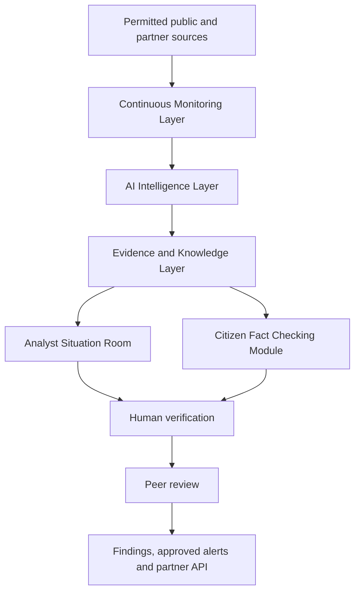
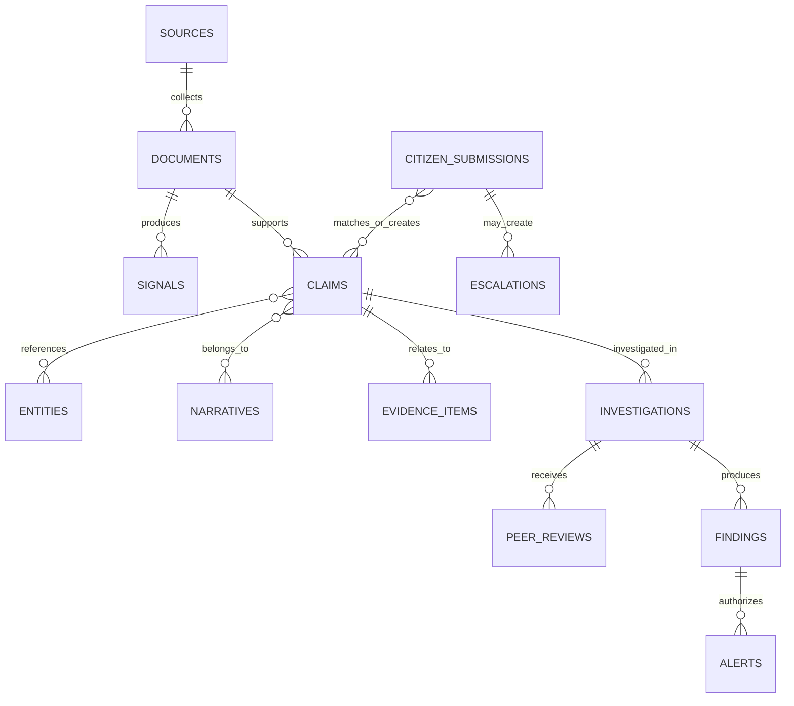
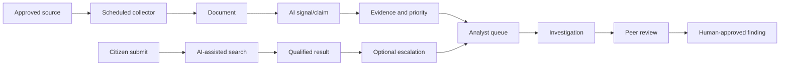

# AIPEIISR Product Architecture and UI Blueprint

**Derived from:** AIPEIISR PRD and System Architecture Version 1.1  
**Purpose:** implementation-ready blueprint; it does not replace the PRD.  
**Labels:** **PRD requirement** is mandated by the PRD; **PRD-derived detail** operationalizes it; **proposed enhancement** needs approval before commitment.

## 1. Product Architecture Overview

AIPEIISR is an always-on, human-led and AI-augmented election-information monitoring and fact-checking platform. “Always-on” in MVP means scheduled, continuous collection from a small approved source registry, not monitoring the entire internet. AI detects, collects, organizes and assists; people investigate, verify, review and authorize findings.



The MVP is a modular monolith: Next.js/TypeScript UI, FastAPI API, PostgreSQL/pgvector, Redis workers, S3-compatible storage and Docker. Modules share one transactional database and communicate through a transactional outbox plus background jobs; they are not independently deployed microservices.

## 2. Product Modules

| Module | Purpose and principal user | Inputs/outputs | Type |
|---|---|---|---|
| Citizen Fact Checking | Citizen submits/searches/investigates; sees qualified results and safe evidence | Submission, search -> result, escalation | PRD requirement |
| Public Findings and Alerts | Public access to approved findings, alerts, methodology | Published data -> read-only views | PRD requirement |
| Continuous Monitoring | Admin-approved scheduled collection and health | Source -> normalized document/signal | PRD requirement |
| Evidence and Knowledge | Shared provenance-aware model for documents, claims, entities, narratives, evidence and relationships | AI/human inputs -> role-scoped knowledge | PRD requirement |
| Analyst Situation Room | Professional monitoring, investigation and coordination | Internal knowledge -> cases, findings | PRD requirement |
| Review and Publication | Independent review and authorization | Analyst submission -> approved finding/archive | PRD requirement |
| Partner Integration | Scoped feeds/API and partner attribution | Approved partner data | PRD requirement |
| Operations and Governance | Sources, users, audit, health, KPI | Configuration/events -> operations view | PRD-derived detail |

## 3. Information Architecture / Navigation

```text
AIPEIISR
├── Public
│   ├── Home / Search
│   ├── Fact Check
│   │   ├── Submit
│   │   ├── Analysis Result
│   │   ├── Evidence View
│   │   └── Submission Status
│   ├── Findings
│   ├── Alerts
│   ├── Methodology and Help
│   └── My Submissions (authenticated optional)
└── Situation Room
    ├── Overview
    ├── Monitoring Feed
    ├── Signals and Claims
    ├── Narratives
    ├── Priority and Citizen Escalations
    ├── Investigations and Evidence
    ├── Media and Patterns
    ├── Reviews, Findings and Alerts
    ├── Sources and Collection Health
    ├── Analytics
    └── Audit Log / Administration
```

## 4. Screen Inventory

| ID | Screen | User | Purpose | Priority | Route |
|---|---|---|---|---|---|
| PUB-01 | Home and Search | Citizen | Search findings/claims; begin fact check | P0 | `/` |
| PUB-02 | Fact Check Submit | Citizen | Submit text, URL or feasible media reference | P0 | `/fact-check` |
| PUB-03 | Analysis Result | Citizen | Show qualified match/evidence/status | P0 | `/fact-check/:submissionId` |
| PUB-04 | Evidence View | Citizen | Explain public evidence and provenance | P0 | `/evidence/:id` |
| PUB-05 | Findings | Citizen | Browse published human-reviewed findings | P0 | `/findings` |
| PUB-06 | Alerts | Citizen | Browse approved alerts | P0 | `/alerts` |
| SR-01 | Overview | Analyst/manager | Situation awareness and action queue | P0 | `/room` |
| SR-02 | Monitoring Feed | Analyst | Inspect collected signals/documents | P0 | `/room/monitoring` |
| SR-03 | Claims Queue | Analyst | Triage claims and create/assign cases | P0 | `/room/claims` |
| SR-04 | Narrative View | Analyst | Govern clusters and timeline | P1 | `/room/narratives/:id` |
| SR-05 | Investigation Workspace | Analyst | Evidence-led case investigation | P0 | `/room/investigations/:id` |
| SR-06 | Evidence Workspace | Analyst/reviewer | Assess provenance and relationship | P0 | `/room/evidence/:id` |
| SR-07 | Priority and Escalations | Manager/analyst | Triage priority recommendations and citizen escalations | P0 | `/room/priority` |
| SR-08 | Media and Patterns | Analyst | Inspect non-authoritative triage signals | P1 | `/room/media-patterns` |
| SR-09 | Peer Review | Reviewer | Approve/reject/request revision | P0 | `/room/reviews/:id` |
| SR-10 | Finding Draft | Publisher | Authorize approved public output | P0 | `/room/findings/:id` |
| SR-11 | Sources and Health | Admin | Manage registry, schedules and collector health | P0 | `/room/sources` |
| SR-12 | Audit and Analytics | Admin/manager | Operational and provenance review | P1 | `/room/operations` |

## 5. Detailed Screen Specifications

All screens include role-aware navigation, a loading skeleton, retryable error state with correlation ID, empty-state guidance, and audit of consequential actions.

| Screen | Layout, components and data | Actions / decisions / APIs / entities |
|---|---|---|
| PUB-01 | Calm search-first landing page; search input, latest human-reviewed findings, approved alerts, “Fact check information” CTA. Data: public findings, alerts, aggregate counts. | Search `/search`; open submit/finding. No AI result is rendered here. Entities: findings, alerts. |
| PUB-02 | Submission form with tabs Text, URL, Media reference; consent/limits, context field and clear status explanation. | Create `POST /citizen/submissions`; scan/validate URL/media; citizens may edit only before processing. Entities: citizen_submissions, media_items. |
| PUB-03 | Submitted information; status badge; related claims, sources, evidence, context, AI-assisted analysis, existing human-reviewed findings. Sections never merge visually. | Escalate `POST /citizen/submissions/:id/escalations`; search/open evidence. AI is read-only. Entities: submission, claims, evidence, finding, escalation. |
| PUB-04/05/06 | Evidence cards show source/date/excerpt/type/link/review status; findings show methodology/evidence; alerts show approval and time. | Read only. APIs `/evidence/:id`, `/findings`, `/alerts`; only public projections. |
| SR-01 | Header health strip; cards for active signals, priority, escalations, pending reviews, source health; queue table and live feed. | Filter, assign, open case; manager escalates. APIs `/analytics`, `/monitoring`, `/priority`. |
| SR-02/03 | Split pane filters + table + detail drawer. Filters source, time, language, geography, status, priority and narrative. | Triage, link/split claims, create case, dismiss with rationale. AI outputs cite source spans. APIs `/documents`, `/signals`, `/claims`. |
| SR-04 | Narrative timeline, members, sources/entities, velocity coverage caveat, relationship controls. | Human merge/split/label only with audit. APIs `/narratives/:id`. |
| SR-05/06 | Three-column case view: claim/timeline, evidence/provenance, notes/workflow. | Add evidence/rationale; request evidence; submit; reviewer comments. APIs `/investigations`, `/evidence`, `/reviews`. Internal evidence is access-controlled. |
| SR-07/08 | Priority table explains factors, and tabs for citizen escalations/media/pattern signals. | Accept/decline/escalate with rationale; no AI action changes case status. APIs `/priority`, `/escalations`, `/media`, `/patterns`. |
| SR-09/10 | Reviewer comparison of claim, evidence and analyst conclusion; finding preview/publication controls. | Request revision/approve; publisher publishes only approved item. APIs `/reviews`, `/findings`, `/alerts`. |
| SR-11/12 | Source registry with health/last/next collection/errors; KPI panels and immutable activity log. | Manage source/schedule, replay job, export audit. APIs `/sources`, `/monitoring/health`, `/analytics`, `/audit`. |

## 6. AI Agent Architecture

| Bounded worker | Input -> output | Guardrails |
|---|---|---|
| Monitoring Agent | Normalized document -> relevance signal and source reference | Approved sources only; no verdict/publish permission |
| Claim Intelligence | Document -> claims, entities, text spans, uncertainty | Schema validation and provenance required |
| Narrative Intelligence | Embeddings/metadata -> ranked related items and proposed cluster | Human governs merge/split/label |
| Evidence Retrieval | Claim/query -> cited supporting, contextual or contradicting materials | Does not decide truth or invent evidence |
| Media Triage | Media item -> technical/content signals and investigation recommendation | “Potentially manipulated; requires investigation,” never conclusive by default |
| Pattern Detection | Time-windowed counts -> unusual volume/repetition signals | No unsupported claim of coordination/intent |
| Priority Agent | Configurable factors -> explainable recommendation | Priority is not factual certainty |
| Investigation Assistant | Scoped knowledge -> cited summary, gaps and draft notes | Read-only; cannot publish, approve, change permissions, silently add sources or state truth |

## 7. AI Processing Pipeline

| Stage | Service/job | Input -> output / entity | Failure and audit |
|---|---|---|---|
| Collect | `collect_source` | source -> raw payload/document | backoff, dead-letter, source health event |
| Normalize/dedupe | `normalize_document` | payload -> document/version/provenance | idempotency/content hash; quarantine invalid payload |
| Classify/extract | `analyze_document` | document -> signal/claim/entity/ai_run | retry transient model failure; mark failed run |
| Embed/relate | `embed_and_match` | claim/document -> embedding/similarity/narrative membership | delayed retry; human can relink |
| Retrieve/triage | `enrich_claim` | claim -> evidence candidates/media/pattern signals | citation mandatory; no output is a finding |
| Prioritize | `recommend_priority` | signals -> recommendation/queue entry | human must triage |
| Verify/publish | workflow actions | investigation -> review -> finding | no worker transition to published |

## 8. Backend Architecture

FastAPI modules: auth/RBAC; source and collection; document/provenance; signals/claims/entities/narratives; evidence/search/vector; media/pattern/priority; investigations; citizen submissions/escalations; reviews/findings/alerts; notifications/partners; audit/analytics. Each module exposes routes, domain services and repository interfaces in one deployable API; workers consume Redis jobs. Transactional outbox records domain events such as `DocumentCreated`, `ClaimCreated`, `CitizenSubmissionCreated`, `InvestigationSubmitted`, `FindingPublished`.

## 9. Database Architecture

| Entity group | Core fields and relationships | Classification |
|---|---|---|
| Identity | users, roles, permissions, organizations; UUID PKs, timestamps | internal / PII where applicable |
| Monitoring | sources, source_permissions, collection_jobs, documents, document_versions, document_provenance | internal; source URL may be public |
| Knowledge | signals, claims, claim_entities, entities, narratives, narrative_memberships, embeddings, evidence_items, evidence_relationships | mixed; publication projection controls access |
| Media/pattern | media_items, media_analysis, pattern_signals, priority_recommendations | internal by default |
| Workflow | investigations, investigation_claims/evidence, peer_reviews, findings, finding_evidence, alerts | internal until finding/alert published |
| Citizen | citizen_submissions, escalations, submission attachments/status | restricted PII/content |
| Control | notifications, audit_logs, ai_runs | internal/restricted |

Every table uses UUID PK, `created_at`, `updated_at`, actor/provenance reference where material, and soft deletion except append-only audit/provenance events. Index source/schedule/status; document hashes/timestamps; claim status/priority/vector; case assignee/status; submission status; finding published time; and audit entity/time. Public APIs read explicit public projections, never raw internal tables.

## 10. Entity Relationship Model



## 11. User Roles and Permissions

| Capability | Citizen | Analyst | Reviewer | Manager | Publisher | Admin | Partner | AI worker |
|---|---|---|---|---|---|---|---|---|
| Public read / submit | Yes | Yes | Yes | Yes | Yes | Yes | scoped | No |
| Internal evidence / investigate | No | Yes | review | oversight | approved only | support | No | scoped read |
| Assign / escalate | own only | request | No | Yes | No | No | No | recommend only |
| Review / approve | No | submit | Yes | policy | No | No | No | No |
| Publish / alert | No | No | No | authorize policy | Yes | configure only | consume | No |
| Manage source/users/audit | No | No | No | limited | No | Yes | No | No |

## 12. User Flows



## 13. Citizen Fact Checking Architecture

Submission service validates/limits text, URL and feasible media reference; stores original content and consent separately; creates a provenance event; then queues safe analysis/search. Result assembler ranks existing published findings first, then public evidence/related claims, and explicitly returns `PUBLISHED_FINDING`, `AI_ASSISTED_ANALYSIS`, `UNDER_INVESTIGATION`, or `INSUFFICIENT_EVIDENCE`. Escalation service evaluates configured factors and creates a reviewable escalation; it does not auto-create a finding.

## 14. Evidence and Knowledge Layer

The shared layer contains normalized documents, source/provenance, claims and text spans, entities, narrative memberships, embeddings/similarity, evidence relations/status, media/pattern signals, investigation context and historical versions. Analysts receive the internal graph and rationale. Citizens receive a safe public projection. Evidence relations are `supports`, `contradicts`, `contextualizes`, `duplicates`, or `requires_review`; relation is an assessment, not automatic proof.

## 15. Monitoring and Always On Architecture

Source registry holds authorization, collection method, interval, language/geography, last success, next run, status/error and owner. Scheduler enqueues jobs at configured intervals; collector writes checkpoint and raw reference; normalization and idempotent deduplication follow; health tracks freshness, latency, attempts, queue age and failures. Typical MVP cadence is an **OPEN DECISION** per source based on terms, importance and resource budget. Failures back off with jitter, become visible in a dead-letter queue, and require authorized replay.

## 16. API Architecture

| Endpoint group | Key routes and authorization |
|---|---|
| Auth/users | `POST /auth/*`, `GET /users`; authenticated/RBAC |
| Monitoring/sources | `GET/POST /sources`, `GET /monitoring/health`, `POST /sources/:id/collect`; admin/manager |
| Knowledge | `GET /documents,/signals,/claims,/entities,/narratives,/evidence,/search`; internal scope; public projections separately |
| Citizen | `POST /citizen/submissions`, `GET /citizen/submissions/:id`, `POST /citizen/submissions/:id/escalations`; public rate-limited/owner scoped |
| Workflow | `POST /investigations`, `/submit`, `/reviews/:id/decision`, `/findings/:id/publish`; role/state guarded |
| Public/partner | `GET /findings,/alerts,/public/search`, partner feeds/webhooks; public or OAuth scopes |
| Control | `GET /analytics,/audit`; manager/admin |

All lists use cursor pagination, allowlisted filters/sort, request ID and problem+JSON errors. Mutations require idempotency key; validation rejects oversized/untrusted media/URLs; endpoints enforce organization and public/internal boundary.

## 17. Background Jobs

| Job | Trigger/frequency | Queue/output/failure |
|---|---|---|
| Source collection | schedule per approved source | `collection`; document or health failure; backoff/DLQ |
| Normalize/dedupe | raw payload created | `ingestion`; document/provenance; idempotent retry |
| AI analysis/enrichment | document/claim created | `ai`; ai_run, signal/claim/evidence candidates; bounded retry |
| Embedding/clustering | claim/document created | `intelligence`; embeddings/membership; retry/detect drift |
| Media/pattern/priority | media/time window/claim change | `intelligence`; recommendations only; visible failure |
| Notification/KPI | finding/alert or schedule | `notifications`/`analytics`; delivery/audit; retry provider failure |

## 18. Frontend Component Architecture

```text
components/{layout,navigation,common,search,fact-check,evidence,findings,alerts,
dashboard,monitoring,claims,narratives,investigations,reviews,sources,analytics,tables,charts}
app/{public routes,room routes,api client,auth,providers}
```

Use typed API client generated from OpenAPI, server state cache with invalidation by event/SSE, minimal local form state, role-based route guards, error boundary and standard skeleton/empty/error components. Reuse status badge, evidence card, source card, provenance panel, timeline, queue table, filter bar and AI-disclosure component.

## 19. Design System

Use neutral dark navy/gray structure, accessible contrast, readable sans-serif typography, 4/8px spacing scale, responsive two/three-column layouts and data tables with persistent filters. Status treatments: human-reviewed finding (calm green/blue plus label), AI-assisted analysis (neutral violet/gray plus disclosure), under investigation (amber), insufficient evidence (gray). Badges describe workflow state, never truth/confidence. Evidence cards prioritize source/date/excerpt/relation/review label; source cards show attribution; timelines show observed and decision dates. Avoid campaign colors, sensational alarms, gamification and unqualified certainty.

## 20. Security and Governance

OIDC/JWT, RBAC, MFA for privileged users, tenant/scoped policies, encryption, secret management, immutable audit, API rate limits and signed webhooks are required. Separate public projections and restricted citizen/analyst data. Minimize PII, record consent, set retention/deletion policy (**OPEN DECISION**), malware-scan/quarantine uploads, protect against SSRF, isolate collectors/browser/media tools, and treat fetched content as untrusted data. AI prompts are injection-resistant, retrieval is cited, model actions are read-only/scoped, and humans can override recommendations. No AI worker has approve/publish/user-management capability.

## 21. Observability

Structured redacted API/worker logs, source-health dashboard, collection success/latency/freshness, queue depth/age, job retry/DLQ, AI latency/cost/failures, API errors/latency, DB health, delivery outcomes and audit integrity. The operations dashboard shows source last/next successful collection, processing backlog, priority/citizen escalation queue and KPI trends.

## 22. MVP Scope

Build the smallest auditable loop: approved source -> scheduled collection -> normalized document -> attributable AI signal/claim -> evidence -> analyst investigation -> peer review -> human-authorized finding, plus citizen -> submission -> AI-assisted search/evidence -> optional escalation -> human review. Keep source count controlled and public media support limited to technically safe formats.

## 23. P0 P1 P2 Priorities

**P0:** identity/RBAC/audit; source registry/scheduler/RSS/API collector; documents/provenance; claims/evidence/search; analyst queue/investigation/review/finding; citizen text/URL submission/search/result/escalation; public findings; health dashboard.  
**P1:** narrative UI, media/pattern views, saved citizen history, partner self-service, richer analytics, notification adapter.  
**P2:** broad public social coverage, advanced media models/reverse search, dedicated search/event streaming/HA, extensive language and geospatial features.

## 24. Engineering Build Order

1. Foundation: repo, Docker, migrations, auth/RBAC, audit, OpenAPI, CI.
2. Knowledge layer: sources, documents/provenance, claims/entities/evidence, public projection/search.
3. Continuous monitoring: scheduler, connectors, normalization/dedupe, health and worker controls.
4. AI intelligence: bounded extraction, embeddings/similarity, retrieval, priority; provenance/evaluation harness.
5. Analyst Situation Room: overview, queues, investigation/evidence, review/finding state guards.
6. Citizen Fact Checking: submit, safe analysis result, evidence view, escalation and status.
7. Public/partner: findings, alerts, scoped API/notifications.
8. Security, test corpus, E2E, restore drill, accessibility, performance and deployment validation.

## 25. MVP Acceptance Criteria

1. An approved source runs on schedule and produces traceable normalized documents.
2. A document produces attributable/rejectable AI signal and claim suggestions.
3. Claims link to documents, evidence, entities and related content.
4. An analyst completes an evidence-led investigation and submits it.
5. A citizen submits information and receives a clearly labelled result state.
6. A qualifying submission escalates to an analyst case without lost provenance.
7. Independent peer review gates approval; only authorized humans publish.
8. AI cannot publish an authoritative finding, access secrets, or turn uncertainty into a verdict.

## 26. Open Decisions Still Requiring Stakeholder Approval

1. Source register, collection permission, cadence and retention terms.
2. Citizen PII/media consent, storage region, retention/deletion and abuse handling.
3. Finding taxonomy and public wording for disputed/unresolved content.
4. Priority/escalation thresholds and public-safety protocol.
5. Reviewer independence, publisher authority and conflict-of-interest policy.
6. Initial languages/accessibility requirements and evaluation dataset ownership.
7. Partner data agreements, model providers/data-processing terms, cost ceilings and incident owners.
